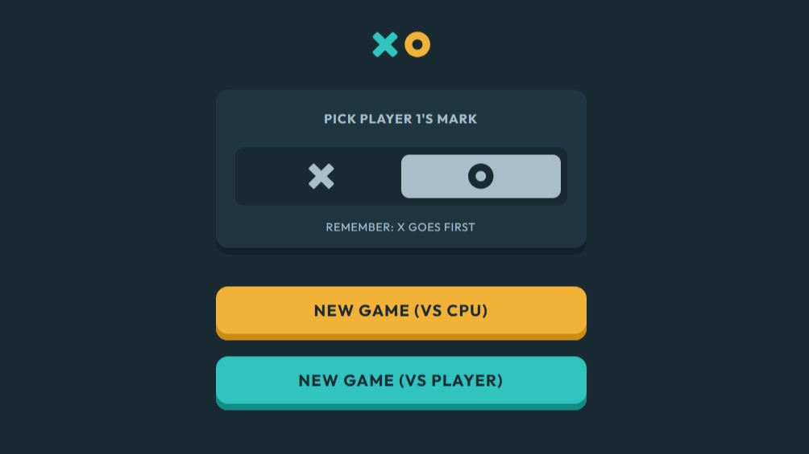

# Frontend Mentor - Tic Tac Toe solution

This is a solution to the [Tic Tac Toe challenge on Frontend Mentor](https://www.frontendmentor.io/challenges/tic-tac-toe-game-Re7ZF_E2v). Frontend Mentor challenges help you improve your coding skills by building realistic projects. 

## Table of contents

- [Frontend Mentor - Tic Tac Toe solution](#frontend-mentor---tic-tac-toe-solution)
  - [Table of contents](#table-of-contents)
  - [Overview](#overview)
    - [The challenge](#the-challenge)
    - [Screenshot](#screenshot)
    - [Links](#links)
  - [My process](#my-process)
    - [Built with](#built-with)
    - [What I learned](#what-i-learned)
    - [Continued development](#continued-development)
    - [Useful resources](#useful-resources)
  - [Author](#author)


## Overview

### The challenge

Users should be able to:

- View the optimal layout for the game depending on their device's screen size
- See hover states for all interactive elements on the page
- Play the game either solo vs the computer or multiplayer against another person
- **Bonus 1**: Save the game state in the browser so that it’s preserved if the player refreshes their browser
- **Bonus 2**: Instead of having the computer randomly make their moves, try making it clever so it’s proactive in blocking your moves and trying to win

### Screenshot



### Links

- Solution URL: [www.frontendmentor.io/solutions/tic-tac-toe-game-with-react-and-tailwind-I2Rvejbl4N](https://www.frontendmentor.io/solutions/tic-tac-toe-game-with-react-and-tailwind-I2Rvejbl4N)
- Live Site URL: [tic-tac-toe-orcin-one.vercel.app/](https://tic-tac-toe-orcin-one.vercel.app/)

## My process

### Built with

- Flexbox
- CSS Grid
- [React](https://reactjs.org/) - JS library
- [Vite](https://vite.dev/) - Build Tool
- [Vercel](https://vercel.com/) - Deployment

### What I learned

I liked solving the hover state for the buttons of the game. Showing the proper icon for each player. Using invisible and group-hover:visible.

```js
    <button
      onClick={handleClick}
      className={`z-0 flex items-center justify-center bg-${color ?? "semi-dark-navy"} shadow-${color ?? "dark-navy"}-shadow group relative h-24 w-full rounded-10 pb-2 shadow-custom-lg md:h-[140px]`}
    >
      {value ? (
        ""
      ) : (
        
      )}
      {icon ?? ""}
    </button>
```

### Continued development

I am going to continue learning React and Tailwind.

### Useful resources

- [Tutorial: Tic-Tac-Toe](https://react.dev/learn/tutorial-tic-tac-toe) - I was stuck on handling the state of the game. This tutorial helped me to understand moving states up.
- [Complete Intro to React, v8](https://frontendmasters.com/courses/complete-react-v8/) - I tried Vite because of this tutorial. They explain hooks really well.
- [Tailwind CSS](https://frontendmasters.com/courses/tailwind-css/) - I also tried Tailwind for the first time. This is a great course and it is very intuitive.
- [How to Scale SVG](https://css-tricks.com/scale-svg/) - viewBox saves your life when dealing with SVGs.

## Author

- Website - [Miguel Zapata](https://miguelzaga.github.io/)
- Frontend Mentor - [@miguelzaga](https://www.frontendmentor.io/profile/miguelzaga)